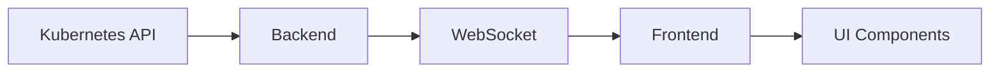
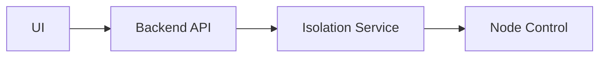
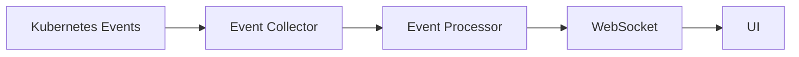

# 구현 상세

## 아키텍처

### 전체 구조
[아키텍처 다이어그램 - 전체 시스템 구조]

### 컴포넌트 구성
1. **프론트엔드 (React)**
   - 대시보드 컴포넌트
   - 노드 관리 컴포넌트
   - 파드 분포 컴포넌트
   - 이벤트 로그 컴포넌트

2. **백엔드 (FastAPI)**
   - API 서버
   - WebSocket 서버
   - 쿠버네티스 클라이언트
   - 격리 제어 서비스

3. **모니터링 시스템**
   - 실시간 메트릭 수집
   - 이벤트 로깅
   - 상태 추적

## 노드 격리 구현

### 1. 네트워크 격리
- **구현**: iptables를 사용한 API 서버 통신 차단
- **코드**: 
```python
async def block_node_network(node: str):
    try:
        # API 서버 IP 가져오기
        api_server = await get_api_server_ip()
        
        # iptables 규칙 추가
        cmd = f"iptables -A OUTPUT -d {api_server} -j DROP"
        result = await run_command(node, cmd)
        
        if result.returncode == 0:
            logger.info(f"Node {node} network isolation started")
            return True
        else:
            logger.error(f"Failed to isolate node {node}: {result.stderr}")
            return False
    except Exception as e:
        logger.error(f"Error during network isolation: {str(e)}")
        return False

async def restore_node_network(node: str):
    try:
        # API 서버 IP 가져오기
        api_server = await get_api_server_ip()
        
        # iptables 규칙 제거
        cmd = f"iptables -D OUTPUT -d {api_server} -j DROP"
        result = await run_command(node, cmd)
        
        if result.returncode == 0:
            logger.info(f"Node {node} network isolation stopped")
            return True
        else:
            logger.error(f"Failed to restore node {node}: {result.stderr}")
            return False
    except Exception as e:
        logger.error(f"Error during network restoration: {str(e)}")
        return False
```

### 2. Kubelet 중지
- **구현**: systemctl을 통한 kubelet 서비스 제어
- **코드**:
```python
async def stop_kubelet(node: str):
    try:
        # kubelet 서비스 중지
        cmd = "systemctl stop kubelet"
        result = await run_command(node, cmd)
        
        if result.returncode == 0:
            logger.info(f"Kubelet service stopped on node {node}")
            return True
        else:
            logger.error(f"Failed to stop kubelet on node {node}: {result.stderr}")
            return False
    except Exception as e:
        logger.error(f"Error stopping kubelet: {str(e)}")
        return False

async def start_kubelet(node: str):
    try:
        # kubelet 서비스 시작
        cmd = "systemctl start kubelet"
        result = await run_command(node, cmd)
        
        if result.returncode == 0:
            logger.info(f"Kubelet service started on node {node}")
            return True
        else:
            logger.error(f"Failed to start kubelet on node {node}: {result.stderr}")
            return False
    except Exception as e:
        logger.error(f"Error starting kubelet: {str(e)}")
        return False
```

### 3. 컨테이너 런타임 중지
- **구현**: containerd/docker 서비스 제어
- **코드**:
```python
async def stop_container_runtime(node: str, runtime: str):
    try:
        if runtime not in ["containerd", "docker"]:
            raise ValueError(f"Unsupported runtime: {runtime}")
            
        # 런타임 서비스 중지
        cmd = f"systemctl stop {runtime}"
        result = await run_command(node, cmd)
        
        if result.returncode == 0:
            logger.info(f"{runtime} service stopped on node {node}")
            return True
        else:
            logger.error(f"Failed to stop {runtime} on node {node}: {result.stderr}")
            return False
    except Exception as e:
        logger.error(f"Error stopping container runtime: {str(e)}")
        return False

async def start_container_runtime(node: str, runtime: str):
    try:
        if runtime not in ["containerd", "docker"]:
            raise ValueError(f"Unsupported runtime: {runtime}")
            
        # 런타임 서비스 시작
        cmd = f"systemctl start {runtime}"
        result = await run_command(node, cmd)
        
        if result.returncode == 0:
            logger.info(f"{runtime} service started on node {node}")
            return True
        else:
            logger.error(f"Failed to start {runtime} on node {node}: {result.stderr}")
            return False
    except Exception as e:
        logger.error(f"Error starting container runtime: {str(e)}")
        return False
```

### 4. 수동 드레인
- **구현**: 커스텀 파드 삭제 로직
- **코드**:
```python
async def drain_node(node: str, grace_period: int = 30):
    try:
        # 노드의 파드 목록 가져오기
        pods = await get_node_pods(node)
        
        # 파드 삭제
        for pod in pods:
            try:
                # 파드 삭제 요청
                await delete_pod(pod.metadata.name, pod.metadata.namespace)
                
                # 파드가 완전히 삭제될 때까지 대기
                await wait_for_pod_deletion(pod.metadata.name, pod.metadata.namespace, grace_period)
                
                logger.info(f"Pod {pod.metadata.name} deleted successfully")
            except Exception as e:
                logger.error(f"Error deleting pod {pod.metadata.name}: {str(e)}")
                continue
        
        logger.info(f"Node {node} drained successfully")
        return True
    except Exception as e:
        logger.error(f"Error during node drain: {str(e)}")
        return False

async def wait_for_pod_deletion(pod_name: str, namespace: str, timeout: int):
    start_time = time.time()
    while time.time() - start_time < timeout:
        try:
            pod = await get_pod(pod_name, namespace)
            if not pod:
                return True
            await asyncio.sleep(1)
        except Exception:
            return True
    raise TimeoutError(f"Pod {pod_name} deletion timeout")
```

### 5. 리소스 고갈
- **구현**: stress-ng를 사용한 리소스 고갈
- **코드**:
```python
async def stress_node(node: str, cpu: int, memory: int, disk: int):
    try:
        # stress-ng 설치 확인
        await check_stress_ng_installation(node)
        
        # CPU, 메모리, 디스크 부하 생성
        cmd = f"stress-ng --cpu {cpu} --vm {memory} --hdd {disk}"
        result = await run_command(node, cmd, background=True)
        
        if result.returncode == 0:
            logger.info(f"Resource stress started on node {node}")
            return True
        else:
            logger.error(f"Failed to start resource stress on node {node}: {result.stderr}")
            return False
    except Exception as e:
        logger.error(f"Error during resource stress: {str(e)}")
        return False

async def stop_stress(node: str):
    try:
        # stress-ng 프로세스 종료
        cmd = "pkill stress-ng"
        result = await run_command(node, cmd)
        
        if result.returncode == 0:
            logger.info(f"Resource stress stopped on node {node}")
            return True
        else:
            logger.error(f"Failed to stop resource stress on node {node}: {result.stderr}")
            return False
    except Exception as e:
        logger.error(f"Error stopping resource stress: {str(e)}")
        return False
```

## 데이터 흐름

### 1. 실시간 모니터링
[데이터 흐름 다이어그램 - 모니터링 데이터 흐름]



### 2. 격리 제어
[데이터 흐름 다이어그램 - 격리 명령 흐름]



### 3. 이벤트 처리
[데이터 흐름 다이어그램 - 이벤트 처리 흐름]



## 주요 컴포넌트

### 프론트엔드

#### 1. 대시보드
```typescript
interface DashboardProps {
  clusterStatus: ClusterStatus;
  podDistribution: PodDistribution[];
  events: MonitoringEvent[];
}

const Dashboard: React.FC<DashboardProps> = ({
  clusterStatus,
  podDistribution,
  events
}) => {
  const { data: realtimeData } = useQuery('monitoring', fetchMonitoringData, {
    refetchInterval: 5000
  });

  return (
    <Box sx={{ p: 3 }}>
      <Grid container spacing={3}>
        <Grid item xs={12} md={6}>
          <ClusterStatusCard status={clusterStatus} />
        </Grid>
        <Grid item xs={12} md={6}>
          <PodDistributionChart data={podDistribution} />
        </Grid>
        <Grid item xs={12}>
          <EventLogTable events={events} />
        </Grid>
      </Grid>
    </Box>
  );
};
```

#### 2. 노드 관리
```typescript
interface NodeManagementProps {
  nodes: Node[];
  onIsolationStart: (node: string, method: string) => void;
  onIsolationStop: (node: string) => void;
}

const NodeManagement: React.FC<NodeManagementProps> = ({
  nodes,
  onIsolationStart,
  onIsolationStop
}) => {
  const [selectedNode, setSelectedNode] = useState<string>('');
  const [selectedMethod, setSelectedMethod] = useState<string>('');

  const handleIsolationStart = () => {
    if (selectedNode && selectedMethod) {
      onIsolationStart(selectedNode, selectedMethod);
    }
  };

  return (
    <Box sx={{ p: 3 }}>
      <FormControl fullWidth sx={{ mb: 2 }}>
        <InputLabel>노드 선택</InputLabel>
        <Select
          value={selectedNode}
          onChange={(e) => setSelectedNode(e.target.value)}
        >
          {nodes.map((node) => (
            <MenuItem key={node.name} value={node.name}>
              {node.name}
            </MenuItem>
          ))}
        </Select>
      </FormControl>
      
      <FormControl fullWidth sx={{ mb: 2 }}>
        <InputLabel>격리 방법</InputLabel>
        <Select
          value={selectedMethod}
          onChange={(e) => setSelectedMethod(e.target.value)}
        >
          <MenuItem value="network">네트워크 격리</MenuItem>
          <MenuItem value="kubelet">Kubelet 중지</MenuItem>
          <MenuItem value="runtime">런타임 중지</MenuItem>
          <MenuItem value="drain">수동 드레인</MenuItem>
          <MenuItem value="stress">리소스 고갈</MenuItem>
        </Select>
      </FormControl>

      <Button
        variant="contained"
        color="primary"
        onClick={handleIsolationStart}
        disabled={!selectedNode || !selectedMethod}
      >
        격리 시작
      </Button>
    </Box>
  );
};
```

### 백엔드

#### 1. API 서버
```python
@router.get("/api/v1/monitoring/data")
async def get_monitoring_data():
    try:
        cluster_status = await get_cluster_status()
        pod_distribution = await get_pod_distribution()
        events = await get_monitoring_events()
        
        return {
            "cluster_status": cluster_status,
            "pod_distribution": pod_distribution,
            "events": events
        }
    except Exception as e:
        logger.error(f"Error fetching monitoring data: {str(e)}")
        raise HTTPException(
            status_code=500,
            detail="Failed to fetch monitoring data"
        )

@router.post("/api/v1/isolation/start")
async def start_isolation(
    request: IsolationRequest,
    current_user: User = Depends(get_current_user)
):
    try:
        result = await isolation_service.start_isolation(
            request.node,
            request.method
        )
        
        if result:
            return {"status": "success"}
        else:
            raise HTTPException(
                status_code=500,
                detail="Failed to start isolation"
            )
    except Exception as e:
        logger.error(f"Error starting isolation: {str(e)}")
        raise HTTPException(
            status_code=500,
            detail=str(e)
        )
```

#### 2. 격리 제어
```python
class IsolationService:
    def __init__(self):
        self.isolation_methods = {
            "network": self.block_node_network,
            "kubelet": self.stop_kubelet,
            "runtime": self.stop_container_runtime,
            "drain": self.drain_node,
            "stress": self.stress_node
        }
    
    async def start_isolation(self, node: str, method: str):
        try:
            if method not in self.isolation_methods:
                raise ValueError(f"Unsupported isolation method: {method}")
            
            isolation_func = self.isolation_methods[method]
            return await isolation_func(node)
        except Exception as e:
            logger.error(f"Error in isolation service: {str(e)}")
            return False
    
    async def stop_isolation(self, node: str):
        try:
            # 현재 격리 상태 확인
            isolation_state = await self.get_isolation_state(node)
            
            if not isolation_state:
                return True
            
            # 격리 해제
            if isolation_state["method"] == "network":
                return await self.restore_node_network(node)
            elif isolation_state["method"] == "kubelet":
                return await self.start_kubelet(node)
            elif isolation_state["method"] == "runtime":
                return await self.start_container_runtime(
                    node,
                    isolation_state["runtime"]
                )
            elif isolation_state["method"] == "stress":
                return await self.stop_stress(node)
            
            return True
        except Exception as e:
            logger.error(f"Error stopping isolation: {str(e)}")
            return False
```

## 성능 최적화

### 1. 실시간 데이터 처리
- WebSocket을 통한 효율적인 실시간 통신
- 데이터 캐싱 및 배치 처리
- 메모리 사용량 최적화

### 2. 확장성
- 수평적 확장 지원
- 다중 클러스터 지원
- 부하 분산

## 보안

### 1. 인증
- JWT 기반 인증
- 역할 기반 접근 제어
- 토큰 갱신

### 2. 네트워크
- HTTPS/TLS 적용
- API 요청 검증
- CORS 설정

### 3. 데이터
- 민감 정보 암호화
- 로그 데이터 보호
- 백업 및 복구 