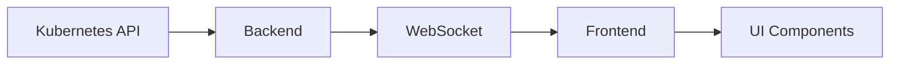
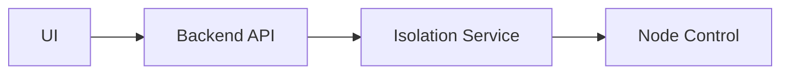
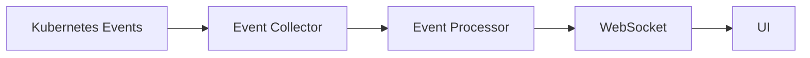

# ISO-Control : Kubernetes Node Isolation Control
본 프로젝트는 쿠버네티스 클러스터의 노드 격리 및 파드 마이그레이션을 제어하는 웹 기반 관리 도구입니다.

## 개요
쿠버네티스 클러스터에서 노드 장애 상황을 시뮬레이션하고 파드 마이그레이션을 테스트하기 위한 풀스택 웹 애플리케이션입니다.

### 주요 기능

### 1. 클러스터 개요
- **실시간 상태 모니터링**: 클러스터 전체 건강도 확인 (정상/주의/위험)
- **핵심 지표 대시보드**: 전체 노드, 준비된 노드, 전체 파드, 실행 중인 파드 통계
- **노드 상태 요약**: 각 노드별 Ready/NotReady 상태 및 역할 표시
- **파드 분포 개요**: 노드별 파드 수와 준비 상태 진행률 바 시각화
- **자동 업데이트**: 타임스탬프 기반 마지막 업데이트 시간 표시

### 2. 노드 관리
워커 노드만 제어 가능하도록 제한됩니다.
- **전체 노드 테이블**: 노드명, 상태, 역할, 버전, 내부 IP 정보 표시
- **노드 제어 기능**: 
  - **Cordon**: 워커 노드 스케줄링 비활성화
  - **Uncordon**: 워커 노드 스케줄링 활성화
  - **Drain**: 노드의 모든 파드를 다른 노드로 마이그레이션
- **노드 타입 구분**: 컨트롤 플레인 노드와 워커 노드 구분 표시
- **실시간 상태 반영**: 작업 후 즉시 노드 상태 업데이트


### 3. 파드 분포
- **통계 요약**: 총 파드 수, 실행 중인 파드, 활성 노드 수, 실시간 업데이트 시간
- **노드별 분포 시각화**: 
  - 각 노드별 파드 상태 진행률 바
  - 준비된 파드 수 / 전체 파드 수 비율 표시
- **파드 상세 목록**: 
  - 파드명, 네임스페이스, 재시작 횟수
  - 파드 상태별 구분 (Running/Pending/Failed/Terminating)
- **실시간 새로고침**: 수동 새로고침 버튼 및 자동 업데이트

### 4. 격리 제어
- **격리 방법 선택**:
  1. **Kubelet 중지**: kubelet 서비스를 중지하여 노드 격리
  2. **네트워크 차단**: iptables로 API 서버 통신 차단
  3. **런타임 중지**: 컨테이너 런타임 중지
  4. **파드 드레인**: 수동으로 파드 삭제
  5. **극한 부하**: 극한 리소스 고갈 시뮬레이션
- **격리 제어 인터페이스**:
  - 워커 노드 선택 (컨트롤 플레인 노드 제외)
  - 격리 지속 시간 설정 (60초~3600초)
  - 선택한 방법별 상세 설명 표시
- **작업 모니터링**:
  - 실행 중인 격리 작업 실시간 추적
  - 작업 상태별 색상 구분 (running/completed/failed/stopping)
  - 작업 시작 시간 및 진행 상황 표시
  - 실행 중인 작업 중지 기능

### 5. 이벤트 로그
- **타임라인 형태 표시**: 이벤트를 시간순으로 타임라인 형태로 시각화
- **이벤트 타입 구분**: 
  - Normal (파란색): 일반적인 시스템 이벤트
  - Warning (노란색): 주의가 필요한 이벤트
  - Error (빨간색): 오류 이벤트
- **상세 정보 표시**:
  - 이벤트 메시지 및 관련 객체명
  - 정확한 타임스탬프 (년/월/일 시:분:초)
  - 이벤트 연결선으로 시간 흐름 표시
- **실시간 스트리밍**: 새로운 이벤트 자동 추가 및 수동 새로고침
- **Context 기반 관리**: PodContext를 통한 효율적인 상태 관리

## 기술 스택

### Backend
- **프레임워크**: FastAPI
- **언어**: Python 3.9+
- **쿠버네티스 클라이언트**: kubernetes-python
- **비동기 처리**: asyncio
- **실시간 통신**: Socket.IO
- **API 문서**: Swagger/OpenAPI

### Frontend  
- **프레임워크**: React 18.2.0
- **언어**: TypeScript 4.9.4
- **상태 관리**: React Context API
- **데이터 페칭**: React Query 3.39.3
- **스타일링**: Tailwind CSS 3.3.6
- **아이콘**: Lucide React 0.294.0
- **차트**: Chart.js 4.4.0 + React-chartjs-2 5.2.0
- **실시간 통신**: Socket.io-client 4.7.4
- **HTTP 클라이언트**: Axios 1.9.0

### DevOps
- **컨테이너**: Docker & Docker Compose
- **쿠버네티스**: 1.27+
- **환경변수 관리**: .env 파일

## 시작하기

### 사전 요구사항
- Docker & Docker Compose
- 쿠버네티스 클러스터 (1.27+)
- Node.js 16.x +
- Python 3.9 +

1. **저장소 클론**
```bash
git clone https://github.com/yejinj/iso-control.git
cd iso-control
```

2. **환경변수 설정**
```bash
# 루트 디렉토리
cp .env.example .env

# 백엔드
cp backend/.env.example backend/.env
# SSH_PASSWORD를 실제 값으로 수정

# 프론트엔드  
cp frontend/.env.example frontend/.env
```

3. **Docker Compose 실행**
```bash
docker compose up -d
```

### 로컬 개발 환경

#### Backend
```bash
cd backend
python -m venv venv
source venv/bin/activate  # Windows: venv\Scripts\activate
pip install -r requirements.txt
uvicorn app.main:app
```

#### Frontend
```bash
cd frontend
npm install
npm start
```

## 사용법 및 환경 설정

자세한 사용법은 [USAGE.md](USAGE.md)를 참고하세요.
환경 변수 설정은 [ENV_CONFIG.md](ENV_CONFIG.md)를 참고하세요.

## 아키텍처

### 전체 구조
[아키텍처 다이어그램 - 전체 시스템 구조]

### 컴포넌트 구성
1. **프론트엔드 (React)**
   - 대시보드 컴포넌트
   - 노드 관리 컴포넌트
   - 파드 분포 컴포넌트
   - 이벤트 로그 컴포넌트

2. **백엔드 (FastAPI)**
   - API 서버
   - WebSocket 서버
   - 쿠버네티스 클라이언트
   - 격리 제어 서비스

3. **모니터링 시스템**
   - 실시간 메트릭 수집
   - 이벤트 로깅
   - 상태 추적

### 데이터 흐름

#### 1. 실시간 모니터링
[데이터 흐름 다이어그램 - 모니터링 데이터 흐름]



#### 2. 격리 제어
[데이터 흐름 다이어그램 - 격리 명령 흐름]



#### 3. 이벤트 처리
[데이터 흐름 다이어그램 - 이벤트 처리 흐름]

