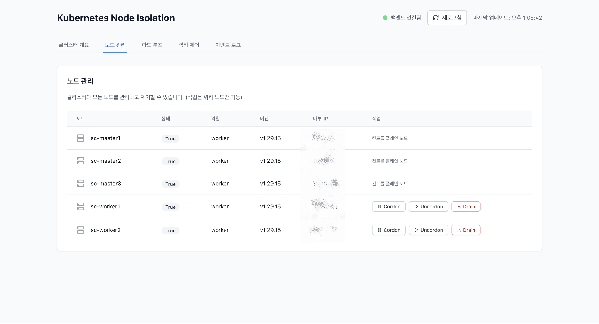
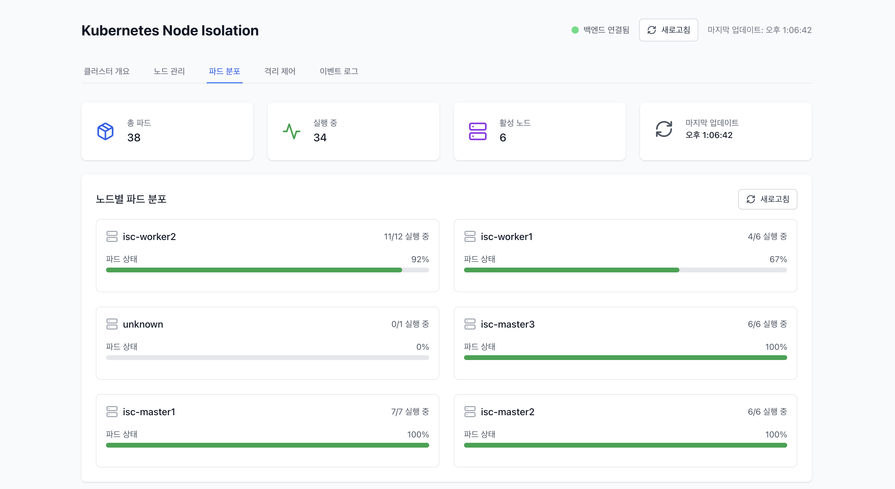
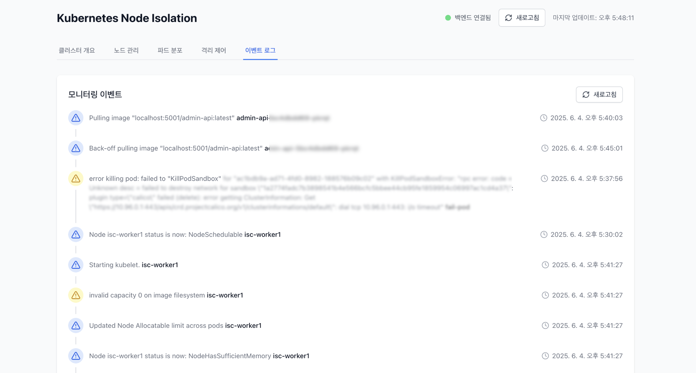

# 사용 가이드

## 대시보드

### 메인 대시보드

메인 대시보드에서 다음 정보를 확인할 수 있습니다.
- 클러스터 전체 상태 확인 
- 노드별 파드 분포 확인
- 실시간 이벤트 모니터링
- 우상단에 백엔드 연결 상태 및 새로고침 버튼
- 마지막 업데이트 시간

### 탭 네비게이션
대시보드는 5개의 주요 탭으로 구성되어 있습니다.
1. **클러스터 개요**: 전체 상태 모니터링
2. **노드 관리**: 노드 제어 및 관리
3. **파드 분포**: 파드 분포 시각화
4. **격리 제어**: 노드 격리 테스트
5. **이벤트 로그**: 실시간 이벤트 추적

## 1. 클러스터 개요

**확인 가능한 정보:**
- **건강도 상태**: 노드, 파드 상태 비율에 따라 결정되는 정상/주의/위험 단계별 표시
- **핵심 지표 카드**: 전체 노드, 준비된 노드, 전체 파드, 실행 중인 파드 통계
- **노드 상태 요약**: 컨트롤 / 플레인 워커 각 노드별 Ready/NotReady 상태 및 역할 표시
- **파드 분포 개요**: 노드별 파드 수와 준비 상태 진행률 바 시각화
- **자동 업데이트**: 타임스탬프 기반 마지막 업데이트 시간

## 2. 노드 관리

워커 노드만 제어 가능하도록 제한됩니다.

### Cordon (스케줄링 비활성화)
해당 노드에 새로운 파드가 스케줄링되지 않습니다.

**사용법:**
1. **노드 관리** 탭 선택
2. 워커 노드 행에서 **Cordon** 버튼 클릭
3. 확인 대화상자에서 "확인" 클릭

### Uncordon (스케줄링 활성화)
해당 노드에 새로운 파드 스케줄링이 재개됩니다.

1. **노드 관리** 탭 선택
2. 워커 노드 행에서 **Uncordon** 버튼 클릭
3. 확인 대화상자에서 "확인" 클릭

### Drain (파드 마이그레이션)
노드의 모든 파드가 다른 노드로 이동합니다.

1. **노드 관리** 탭 선택
2. 워커 노드 행에서 **Drain** 버튼 클릭
3. 확인 대화상자에서 "확인" 클릭

## 3. 파드 분포

파드 분포를 시각화하여 확인 가능합니다.

**시각화 정보:**
- **요약 통계**: 상단 4개 카드에 핵심 지표 표시 (총 파드, 실행 중인 파드, 활성 노드, 마지막 업데이트 시간)
- **노드별 분포**: 각 노드의 파드 수 및 상태 진행률 바
- **파드 상세 목록**: 
  - 파드명, 네임스페이스, 재시작 횟수
  - 상태별 색상 구분 (Running/Pending/Failed/Terminating)
- **스크롤 기능**: 각 노드당 최대 48개 파드까지 스크롤로 확인 가능

## 4. 격리 제어

### 격리 방법

#### 1. Kubelet 중지

kubelet 서비스가 중지되어 파드 상태 관리가 불가능해집니다.

1. **격리 제어** 탭 선택
2. 대상 노드 선택 (워커 노드만 가능)
3. 격리 방법에서 **Kubelet 중지** 선택
4. 지속 시간 설정 (60초~3600초)
5. **격리 시작** 버튼 클릭
6. 격리 해제 시 작업 목록에서 **중지** 버튼 클릭

#### 2. 네트워크 차단

iptables로 API 서버와의 네트워크 통신이 차단되어 노드가 클러스터에서 분리됩니다.

1. **격리 제어** 탭 선택
2. 대상 노드 선택 (워커 노드만 가능)
3. 격리 방법에서 **네트워크 차단** 선택
4. 지속 시간 설정 (60초~3600초)
5. **격리 시작** 버튼 클릭
6. 격리 해제 시 작업 목록에서 **중지** 버튼 클릭

#### 3. 런타임 중지

컨테이너 런타임이 중지되어 새로운 컨테이너 생성이 불가능해집니다.

1. **격리 제어** 탭 선택
2. 대상 노드 선택
3. 격리 방법에서 **런타임 중지** 선택
4. 지속 시간 설정
5. **격리 시작** 버튼 클릭
6. 서비스 재시작 시 **중지** 버튼 클릭

#### 4. 파드 드레인

수동으로 파드를 삭제하여 노드의 모든 파드가 다른 노드로 마이그레이션됩니다.

1. **격리 제어** 탭 선택
2. 대상 노드 선택
3. 격리 방법에서 **파드 드레인** 선택
4. 지속 시간 설정
5. **격리 시작** 버튼 클릭

#### 5. 극한 부하

극한 리소스 고갈 시뮬레이션으로 노드 성능이 저하되어 성능 테스트가 가능합니다.

1. **격리 제어** 탭 선택
2. 대상 노드 선택
3. 격리 방법에서 **극한 부하** 선택
4. 지속 시간 설정
5. **격리 시작** 버튼 클릭

### 작업 모니터링
**모니터링 정보:**
- **작업 상태**: running/completed/failed/stopping 구분 (색상별로 표시)
- **작업 세부사항**: 노드명, 격리 방법, 지속 시간
- **시작 시간**: 작업 시작 시점 표시
- **진행 메시지**: 현재 진행 상황 및 결과 메시지

**작업 제어:**
- **중지 기능**: 실행 중인 작업 즉시 중지
- **상태 추적**: 5초마다 자동 상태 업데이트
- **이력 관리**: 완료된 작업 이력 보관

## 5. 이벤트 로그

**이벤트 추적:**
- **타임라인 표시**: 시간순 이벤트 흐름을 연결선으로 시각화
- **이벤트 타입 구분**:
  - Normal (파란색): 일반적인 시스템 이벤트
  - Warning (노란색): 주의가 필요한 이벤트
- **상세 정보**: 이벤트 메시지, 관련 객체명, 정확한 타임스탬프
- **실시간 업데이트**: 새로운 이벤트 자동 추가 및 수동 새로고침